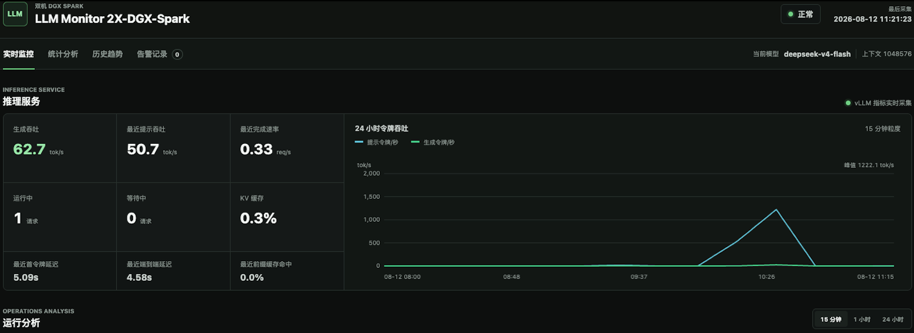
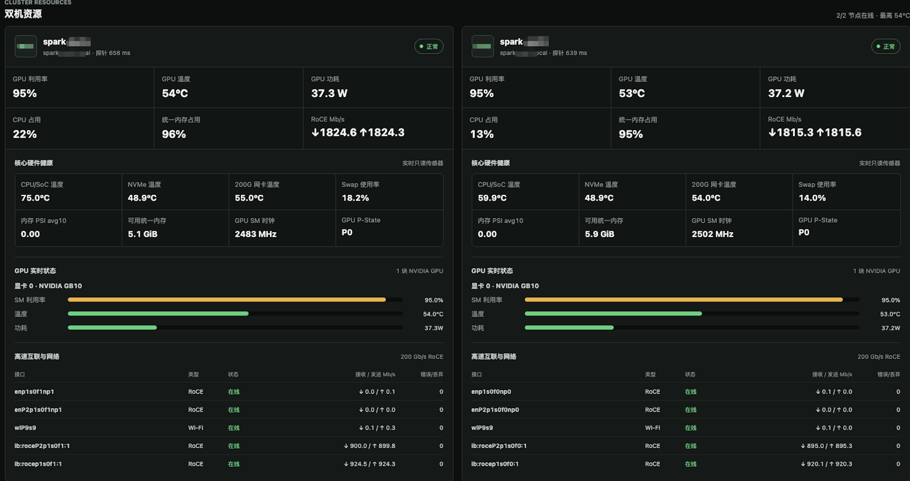
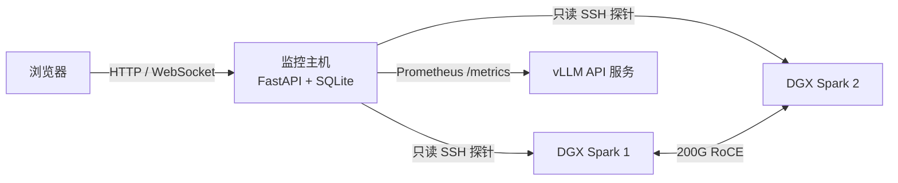

# LLM Monitor 2X-DGX-Spark

面向两台 NVIDIA DGX Spark 组成的 vLLM 推理集群的轻量级监控系统。监控服务可部署在树莓派或其他独立 Linux 监控主机上，通过只读 SSH 探针采集两台 DGX Spark 的硬件与 200G RoCE 指标，并通过 vLLM Prometheus 接口采集推理性能。

## 推理吞吐概览



真实推理负载示例：生成吞吐 62.7 tok/s、最近提示吞吐 50.7 tok/s、完成速率 0.33 req/s、运行请求 1、KV 缓存 0.3%、TTFT 5.09s、端到端延迟 4.58s，24 小时曲线峰值为 1222.1 tok/s。

## 系统概览



真实双机负载示例：两台 GPU 利用率均为 95%，温度为 53-54°C，功耗约 37W，统一内存占用为 95%-96%；200G RoCE 双向流量约 1.8 Gb/s，链路在线且无错误或丢包。

## 功能

- 双节点 GPU、CPU/SoC、统一内存、Swap、内存 PSI、NVMe、功耗与温度监控
- 200G RoCE 链路状态、吞吐、错误、丢包与网卡温度监控
- vLLM 提示/生成吞吐、请求速率、运行/等待请求、KV 缓存、TTFT、端到端延迟与前缀缓存命中率
- 15 分钟、1 小时、24 小时运行分析与防误报逻辑
- SQLite WAL 持久化、60 天滚动保留、历史趋势与告警记录
- 中文响应式 Web 控制台，支持桌面与手机浏览器

## 架构



监控主机不会在 DGX Spark 上安装常驻代理。每次采集时，它通过 SSH 将 `remote/dgx_probe.py` 发送到标准输入并执行，只读取系统传感器、`nvidia-smi` 和网络计数器。

## 指标语义

`运行中`、`等待中` 和 `KV 缓存` 是实时状态，请求结束后回到 0 属于正常行为。提示吞吐、完成速率、TTFT、端到端延迟和缓存命中是短时请求事件；控制台会保留最近一次有效样本 15 分钟，悬停数值可查看样本年龄。SQLite 中保存的仍是原始采样值。

首页 24 小时吞吐图的实线展示 SQLite 原始吞吐采样；`0 tok/s` 表示空闲状态，不写入提示词或生成吞吐历史。虚线按 15 分钟分桶，对桶内已记录的正数采样做算术平均，即 `采样值总和 / 采样次数`。15 分钟只用于时间分桶，不作为均值除数。

## 前提条件

- 监控主机：Linux、Python 3.11+、Node.js 20+（仅构建前端需要）
- 两台 DGX Spark：可通过 SSH 密钥免密登录，安装 `nvidia-smi`
- vLLM：启用并允许监控主机访问 `/metrics` 和 `/v1/models`
- 监控 SSH 用户只需读取传感器和网络统计，不需要 root 权限

## 安装

```bash
git clone git@github.com:codelogickeep/llm-monitor-2x-dgx-spark.git
cd llm-monitor-2x-dgx-spark

cd frontend
npm ci
npm run build
cd ..

python3 -m venv .venv
.venv/bin/pip install -r backend/requirements.txt
```

创建 SSH 密钥并将公钥加入两台 DGX Spark：

```bash
ssh-keygen -t ed25519 -f ~/.ssh/id_ed25519
ssh-copy-id ubuntu@dgx-spark-1.local
ssh-copy-id ubuntu@dgx-spark-2.local
```

## 配置

```bash
cp config.example.env .env
set -a
. ./.env
set +a
```

必须按实际环境修改两台节点的地址、SSH 用户、普通网卡、RoCE 网卡以及 vLLM 地址。网卡名称可用逗号分隔：

```env
DGX_MONITOR_NODE_1_IFACES=enp1s0f1np1,wlan0
DGX_MONITOR_NODE_1_ROCE_IFACES=enp1s0f1np1
```

主要配置项：

| 变量 | 默认值 | 说明 |
| --- | --- | --- |
| `DGX_MONITOR_SSH_USER` | `ubuntu` | DGX Spark SSH 用户 |
| `DGX_MONITOR_NODE_1_*` | `dgx-spark-1.local` | 节点 1 名称、地址和网卡 |
| `DGX_MONITOR_NODE_2_*` | `dgx-spark-2.local` | 节点 2 名称、地址和网卡 |
| `DGX_MONITOR_VLLM_METRICS_URL` | `http://dgx-spark-1.local:8000/metrics` | vLLM Prometheus 地址 |
| `DGX_MONITOR_VLLM_MODELS_URL` | `http://dgx-spark-1.local:8000/v1/models` | OpenAI 模型列表地址 |
| `DGX_MONITOR_POLL_INTERVAL` | `2.5` | 采样间隔，单位秒 |
| `DGX_MONITOR_RECENT_VLLM_TTL` | `900` | 最近请求指标保留时间，单位秒 |
| `DGX_MONITOR_DB` | `data/monitor.sqlite3` | SQLite 文件路径 |

## 运行

开发或前台运行：

```bash
.venv/bin/python -m uvicorn app:app \
  --app-dir backend --host 0.0.0.0 --port 18080
```

打开 `http://<monitor-host>:18080`。

生产环境可参考 `systemd/llm-monitor-2x-dgx-spark.service`。将项目安装到 `/opt/llm-monitor-2x-dgx-spark`，配置写入 `/etc/llm-monitor-2x-dgx-spark.env`，并确保服务用户拥有两台 DGX Spark 的 SSH 私钥：

```bash
sudo useradd --system --create-home --shell /usr/sbin/nologin llm-monitor
sudo mkdir -p /opt/llm-monitor-2x-dgx-spark /var/lib/llm-monitor-2x-dgx-spark
sudo chown -R llm-monitor:llm-monitor \
  /opt/llm-monitor-2x-dgx-spark /var/lib/llm-monitor-2x-dgx-spark
sudo cp systemd/llm-monitor-2x-dgx-spark.service /etc/systemd/system/
sudo systemctl daemon-reload
sudo systemctl enable --now llm-monitor-2x-dgx-spark.service
```

## 测试

```bash
cd frontend && npm ci && npm run build && cd ..
.venv/bin/python -m unittest discover -s backend -p 'test_*.py' -v
```

## 安全建议

- 使用专用、无 sudo 权限的 SSH 用户与独立密钥。
- 仅向可信管理网络开放监控端口，不直接暴露到公网。
- 使用防火墙限制 vLLM `/metrics` 与 API 端口只允许监控主机访问。
- `.env`、SSH 私钥和 SQLite 数据库已被 `.gitignore` 排除，不要提交真实凭据或内网地址。

## License

[MIT](LICENSE)
